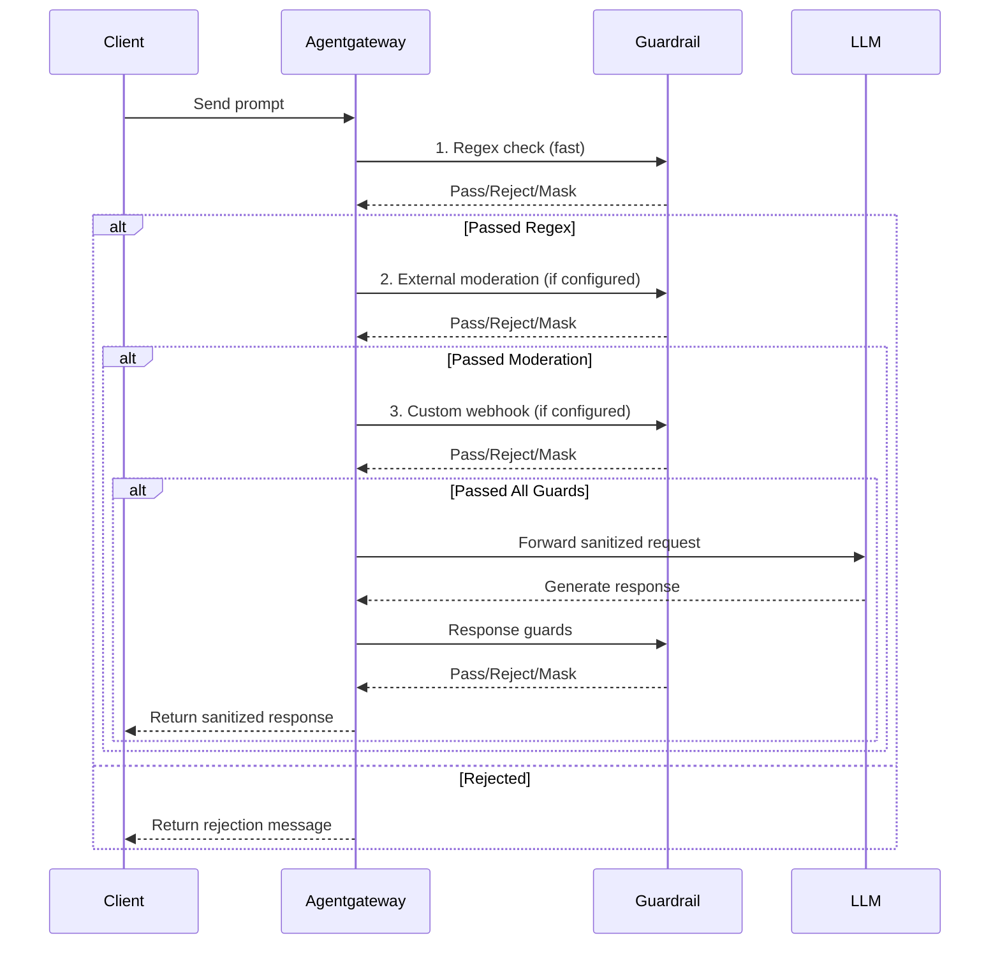

Protect LLM requests and responses from sensitive data exposure and harmful content using layered content safety controls.

## About

In agentgateway, you can use guardrails to help prevent sensitive information from reaching LLM providers and block harmful content in both requests and responses. Guardrails broadly cover a range of content safety techniques including personally identifiable information (PII) detection, PII sanitization, data loss prevention, prompt guards, and other guardrail features.

You can layer multiple protection mechanisms to create comprehensive guardrail protection:
- **Regex-based filters**: Fast, deterministic matching for known patterns like credit cards, SSNs, emails, and custom patterns
- **External moderation**: Leverage built-in model moderation endpoints and cloud provider-specific guardrails for advanced content filtering
- **Custom webhooks**: Integrate your own guardrail logic for specialized requirements

## How guardrails works

Agentgateway checks for content safety in the request and response paths. You can configure multiple prompt guards that run in sequence, allowing you to combine different detection methods.

The diagram shows content flowing through multiple guard layers. Each layer can:
- **Pass**: Allow content to proceed to the next layer
- **Reject**: Block the request and return an error message
- **Mask**: Replace sensitive patterns with placeholders and continue

## Choosing the right approach

Use this table to decide which guardrail layer to use for your requirements:

| Requirement | Recommended Approach | Reason |
|-------------|---------------------|--------|
| Detect known PII formats (SSN, credit cards, emails) | Regex with builtins | Fast, deterministic, no external dependencies |
| Block hate speech, violence, harmful content | External moderation (OpenAI, Bedrock, Azure) | ML-based detection trained for content safety |
| Organization-specific restricted terms | Regex with custom patterns | Simple pattern matching for known strings |
| Named entity recognition (people, orgs, places) | Custom webhook | Requires NER models not available in built-in options |
| HIPAA, PCI-DSS, or other compliance requirements | Layered approach | Combine regex + external moderation + custom validation |
| Jailbreak - DAN & Role Hijacking | Regex with custom patterns | Pattern-match known jailbreak phrases and role-injection strings before they reach the LLM |
| Credentials & Secrets (API keys, tokens, passwords) | Regex with custom patterns | Deterministic pattern matching for structured credential formats with no external dependencies |
| System prompt extraction | Regex with custom patterns | Detect phrases that attempt to reveal or override system instructions before the request is forwarded |
| Encoding Evasion & Delimiter Injection | Regex with custom patterns | Match encoded or delimiter-based bypass patterns to block evasion attempts early in the pipeline |
| Integration with existing DLP tools | Custom webhook | Allows reuse of existing security infrastructure |
| Fastest performance with minimal latency | Regex only | No external API calls |
| Most comprehensive protection | All three layers | Defense-in-depth with multiple detection methods |

## Performance considerations

Each content safety layer adds latency to requests. Plan your configuration accordingly:

- **Regex guards**: < 1ms per check, negligible latency impact
- **External moderation**: 50-200ms depending on provider and network latency
- **Custom webhooks**: Varies based on webhook implementation and location

To optimize performance:
- Use regex for fast, deterministic checks before slower external checks
- Deploy webhook servers in the same region as agentgateway
- Configure appropriate timeouts for external moderation endpoints
- Consider request size limits to avoid processing very large prompts

## Next steps

Check out the following guides to build your guardrail system. 


  
  
  
  
  
  
  


To track guardrails and content safety, see the following guide. 


  

